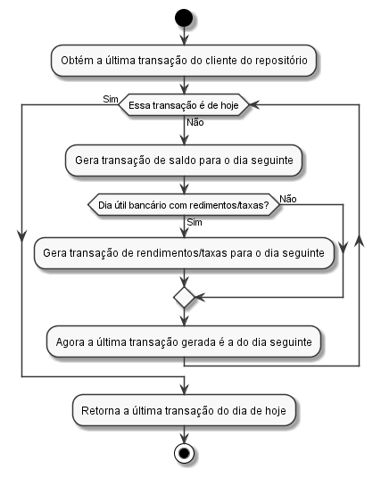
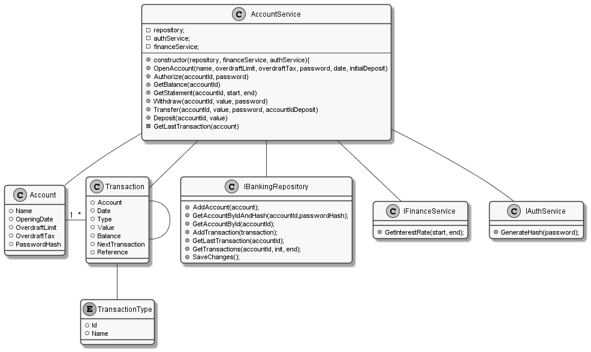

# Marren
Este é um exemplo de aplicação de conta corrente usando arquitetura DDD (Domain Driven Design) e EntityFramework, ASP.NET core e reactjs. O nome Marren é um trocadilho com o nome do autor **M**aico e a fintech de investimentos **W**arren.

Uma versão funcional da aplicação pode ser encontrada em:
http://marren.feitoria.com

## Domínio

Um sistema de controle de conta corrente bancária, processando solicitações de depósito, resgates e pagamentos\*. Possibilita a rentabilidade o dinheiro parado em conta de um dia para o outro (dias úteis) como uma conta corrente remunerada. Dispõe de limite de cheque especial e cobrança de taxas sobre a utilização desse limite. O acesso a conta deve ser autorizado por senha.

\* *Como "pagamentos" se entende transferência entre contas, já que um mesmo cliente pode ter mais de uma conta, pode transferir entre suas contas, não necessariamente fazendo um pagamento.*

### Glossário

* ***Account*** - Conta Corrente com nome e senha que possui um saldo e movimentações.
* ***Transaction*** - Uma transação referente a uma Conta Corrente - Account.
* ***OverdraftLimit*** - O limite do cheque especial de uma conta.
* ***OverdraftTax*** - A taxa diária cobrada sobre o limite do cheque especial utilizado de uma conta.
* ***Balance*** - O saldo de uma conta corrente.
* ***Withdraw*** - Operação de saque de uma conta.
* ***Deposit*** - Operação de depósito de uma conta.
* ***Tranfer*** - Transferência ente contas.
* ***Statment*** - Extrato dos movimentos de uma conta.
* ***Interest*** - Rendimentos da conta do cliente.
* ***Fees*** - Taxas por uso do limite do cheque especial.

### Entidades, Contratos e Serviços do domínio
**Entidades**:

* ***Account*** - Representa a conta do cliente sim si.
    * ***Name*** - Nome do títular, deve ter entre 1 e 50 caracteres
    * ***OverdraftLimit*** - Limite do cheque especial deve estar entre 0 e 1000000000
    * ***OverdraftTax*** - A taxa do cheque especial deve estar entre 0 e 1 (Lembrando que a taxa é diária)
    * ***PasswordHash*** - O hash da senha é obrigatório
    * ***OpeningDate*** - A data de abertura não pode ser futura mas pode ser retroativa. (Para evidenciar o calculo dos rendimentos e taxas). Essa data não pode ser anterior a 01/03/2020 para não prejudicar o desempenho.
* ***Transaction*** - Representa um movimento da conta do cliente.
    * ***Account*** - A conta corrente da transação, obrigatória.
    * ***Date*** - Data da transação não pode ser futura (Sistema não prevê agendamentos.)
    * ***Type*** - Tipo de transação, é obrigatório e deve ser um tipo válido.
    * ***Value*** - Valor - será sempre arredondado em duas casas automaticamente, pode ser zero ou número negativo.
    * ***Balance*** - Saldo - será sempre arredondado em duas casas automaticamente, pode ser zero ou negativo.
    * ***Reference*** - Referência, indica uma observação sobre a transação. Usado na transferência entre contas para indicar a origem e destino da transferência.
* ***TransactionType*** - Tipos de transações possíveis.
    * Opening - Transação de marcação da abertura da conta.
    * Balance - Transação para registro de saldo.
    * Withdraw - Transação de saque.
    * Deposit - Transação de depósito.
    * Interest - Transação de Rendimentos.
    * Fees - Transação de Taxas de uso do cheque especial.
    * TransferOut - Transferência enviada para outra conta.
    * TransferIn - Transferência recebida de outra conta.

**Operações com entidades:**

* ***Account*** 
    * ValidatePassword - Valida a senha que deve ter ao menos 3 caracteres.
* ***Transaction*** 
    * Deposit - Gera uma nova transação de depósito com base na atual (conta e saldo)
        * Valor deve ser maior que zero.
        * Valor deve ser menor que 1000000000.
    * Withdraw - Gera uma nova transação de saque com base na atual (conta e saldo).
        * Valor deve ser maior que zero.
        * Valor deve ser menor que 1000000000.
        * Valor deve ser menor que o Saldo Atual + Limite da Conta.
        * Nova transação gerada com valor negativo.
    * Transfer - Gera duas novas transações de transferência com base na atual (conta e saldo).
        * Valor deve ser maior que zero.
        * Valor deve ser menor que 1000000000.
        * Valor deve ser menor que o Saldo Atual + Limite da Conta.
        * Nova transação de saída gerada com valor negativo.
        * Nova transação de entrada gerada com valor positivo para o destinatário.
    * GenerateNextDayBalance - Gera transações de saldo e/ou rendimentos/taxas com base na atual para o dia seguinte.
        * Taxa de Juros deve ser maior ou igual a zero.
        * Taxa do Cheque especial deve ser maior ou igual a zero.
        * Gera transação de saldo para o dia seguinte.
        * Se a taxa de juros for maior que zero (significa dia útil):
            * Gera transação de rendimento/taxas para o dia seguinte.
    * ValidateStatementFilter - Valida filtro do extrato bancário.
        * Data início não pode ser futura e não pode ser anterior a 01/03/2020.
        * Data final, se informada não pode ser anterior a inicial.
        * O período pesquisado não pode ser superior a 100 dias.
        

### Serviço AccountService

Para trabalhar com a conta corrente (Account) foi identificada a necessidade de um serviço para orquestrar nas suas operações os diversos serviços de infra estrutura e o repositório.

O problema do saldo:

*O saldo não pode ficar armazenado com a conta do cliente porque seu valor pode estar desatualizado em relação as taxas e rendimentos. É mais simples obter o saldo da última transação, que pela data pode-se averiguar se é o saldo atual.*

Métodos:

* ***OpenAccount***
    * Obtém o hash da senha no serviço de autorização.
    * Gera e salva a conta no repositório.
    * Gera e salva a transação de abertura no repositório.
* ***Authorize***
    * Obtém o hash da senha no serviço de autorização.
    * Obtém a conta do cliente por id e hash do repositório.
    * Retorna a conta correnspondente ao login, se econtrada.
* ***GetBalance***
    * Obtém a conta do repositório pelo ID.
    * Obtém a última transação do cliente para o dia*
    * Retorna o saldo dessa transação.
* ***Deposit***
    * Obtém a conta do repositório pelo ID.
    * Obtém a última transação do cliente para o dia*.
    * Gera uma nova transação de depósito.
    * Retorna o saldo dessa transação.
* ***Withdraw***
    * Obtém a conta autorizada, com senha.
    * Obtém a última transação do cliente para o dia*.
    * Gera uma nova transação de saque.
    * Retorna o saldo dessa transação.
* ***Transfer***
    * Obtém a conta autorizada, com senha.
    * Obtém a última transação do cliente origem para o dia*.
    * Obtém a última transação do cliente destino para o dia*. 
    * Gera uma nova transação de transferência para o cliente origem.
    * Gera uma nova transação de transferência para o cliente destino.
    * Retorna o saldo da transação do cliente origem.
* ***GetStatment***
    * Obtém a conta do repositório pelo ID.
    * Obtém a lista de transações do cliente no período.
    * Retorna a lista de transações.

\* Para obter a última transação do cliente no dia, o serviço deve realizar os seguintes procedimentos:




## Estrutura geral das classes do domínio




## Infraestrura

A infrastrutura é composta dos serviços:

* ***Marren.Banking.Infrastructure.Contexts.BankingAccountRepository*** - Repositório EntityFramework em SQLite.
* ***Marren.Banking.Infrastructure.Services.FinanceService*** - Serviço de busca da taxa SELIC no WebService do BACEN
    * O serviço retorna JSON com datas e taxas do período
    * O serviço não trás as datas que não são dias úteis bancários.
* ***Marren.Banking.Infrastructure.Services.AuthService*** - Serviço de geração de hash de senha
    * Gera o HASH em SHA256
    * Gera o TOKEN JWT para a aplicação
    * Armazena a chave privada para o JWT.

## Aplicação Marren.Banking.Application

A aplicação é um site ASP.NET que integra todos os componentes do domínio com os da infraestrutura, adicionando a eles uma camada de autenticação JWT. 
A API REST que expõe o serviço do AccountService está implementada na *Controller* BankingAccountController.

O cliente deve usar a autenticação *Bearer* no cabeçalho HTTP usando um token obtido numa autenticação prévia, no método Authenticate desta *controller*. Para identificar o cliente logado foi criada a *claim* "marren_account_id".

Exemplo de código explicado:
```csharp
    [HttpPost]
    [Route("withdraw")] //rota http
    [Authorize] //Indica que o usuário deve estar autenticado. [AllowAnonymous] permite acesso irrestrito.
    public async Task<Result<decimal>> Withdraw([FromBody] Withdraw data)
    {
        try
        {
            //Obtém-se o ID do cliente da Claim registrada durante a autenticação. Ver Marren.Banking.Intrastructure.Services.AuthService onde é realizado este registro.
            var accountId = User.Claims.Where(x => x.Type == "marren_account_id").Select(x => int.Parse(x.Value)).FirstOrDefault();
            var balance = await this.service.Withdraw(accountId, data.Ammount, data.Password);
            return Result.Create(balance);
        }
        catch (BankingDomainException ex)
        {
            return Result.Create<decimal>(ex);
        }
    }
```

Para cada operação do AccountService foi criado um ViewModel específico contendo os parâmetros das operações disponíveis no AccountService. Nenhuma validação é realizado na Aplicação, sendo essa tarefa exclusiva do domínio.

## Frontend

Um frontend simplificado foi construído usando reactjs para testar a viabilidade da solução.

O site simula um chatbot que permite ao cliente acessar sua conta corrente usando o próprio chat.


A autenticação foi realizada configurando o token no header das requisições autenticadas, como neste exemplo:

```js
const requestOptions = {
    method: 'POST',
    headers: {
        'Content-Type': 'application/json',
        'Authorization': 'Bearer ' + token //token obtido previamente ao chamar o método Authenticate
    },
    body: JSON.stringify(data)
};

const response = await fetch('BankingAccount/' + method, requestOptions);
```

## Testes

Foram desenvolvidas as classes de teste:

* ***Marren.Banking.Tests.DomainTests.AccountServiceTests*** - Teste das classes de domínio com infra estrutura "dummy" para facilitar os testes onde ocorrem cálculos.
* ***Marren.Banking.Tests.InfrastructureTests.InfrastructureTests*** - Testes integrados com os serviços de infraestrutura. Um banco de dados SQLite é gerado todo novo teste iniciado.
    * Um teste de concorrência foi retirado porque o SQLite não suporta bem o uso de threads e async.


## Melhoria continua e próximos passos

* Migrar para o MySQL ou outro banco de dados mais robusto que o SQLite.
    * O package https://www.nuget.org/packages/Pomelo.EntityFrameworkCore.MySql/ parece estar bem maduro e seria interessante testá-lo.
* Verificar a línguagem ubíqua utilizada, os termos em inglês podem não representar corretamente o significado que se quer obter.
* Compatibilizar os erros de validação do domínio com os erros de ViewModel na aplicação ASP.NET
* Desenvolver um frontend baseado em pesquisa com usuários.
* PIX? :sweat_smile: 

## Configuração de ambiente

## Referências

* Autenticação Bearer: https://balta.io/blog/aspnetcore-3-autenticacao-autorizacao-bearer-jwt
* Limitações do EF com SQLite: https://docs.microsoft.com/pt-br/dotnet/standard/data/sqlite/async
* Uma aplicação em DDD com .net muito complexa: https://github.com/dotnet-architecture/eShopOnContainers/tree/master/src/Services/Ordering/Ordering.API

